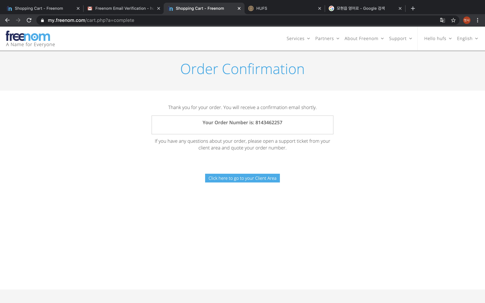

github page freenom custom DNS
=
깃헙 페이지 커스텀 도메인  

1. [freenom.com](freenom.com)사이트에 접속  

2. 화면 중앙 도메인 검색창에 원하는 도메인명 검색

3. 도메인의 최상위 도메인을 찾는다 페이지 상단에는 무료 도메인이고 내려보면 유료 도메인도 있다.

4. 원하는 도메인의 오른쪽 Get it now! 버튼을 선택하고 나오는 우측 상단 checkout 버튼 선택

5. 오른쪽의 Period(기간)을 무료 기간 중 가장 긴 12months 를 선택하고 continue

6. 왼쪽하단에 회원가입할 이메일을 작성하고 Verify My Email Address 를 선택

7. 메일에서 링크를 선택한다. 

8. name, address1, phone number 등 필수 정보들만 입력하여 계정을 생성한다. 

9. 정상적으로 도메인 구입 완료

10. 첫 화면으로 돌아와서 Services 메뉴의 my domains로 들어간다.

11. 본인의 도메인관련 정보가 나오고, 해당화면의 Manage Domain 을 선택

12. Manage Freenom DNS 선택

13. 해당 화면이 나온후 깃헙 페이지를 연결시킬 A record 를 검색한다. 

14. 이처럼 4가지의 record 를 선택하고 TTL 을 원하는 시간대로 설정한다. 

15. 연결이 완료되면 본인의 github page가 해당도메인으로 연결

